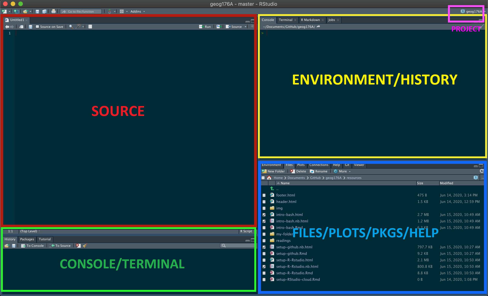
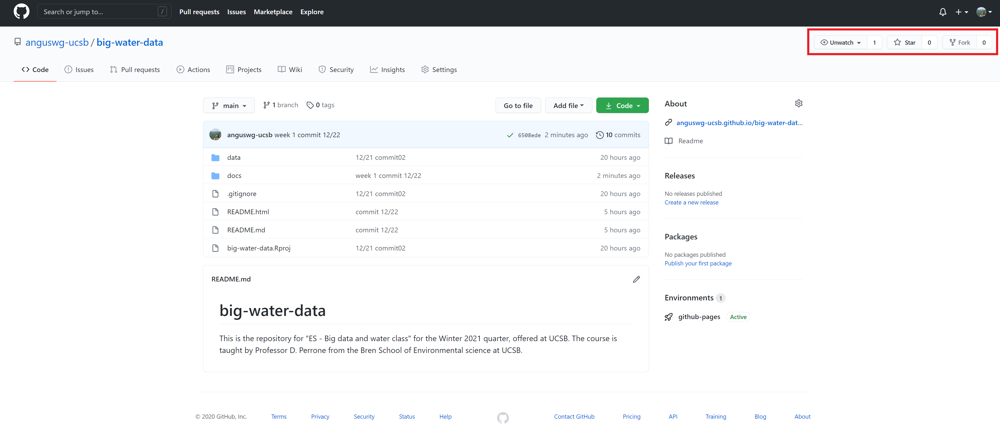
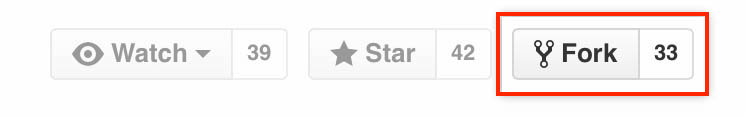
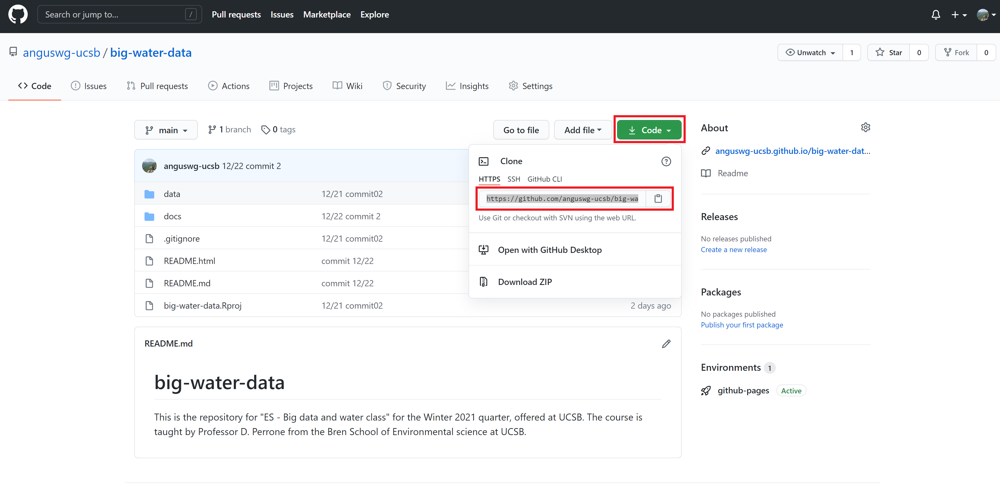
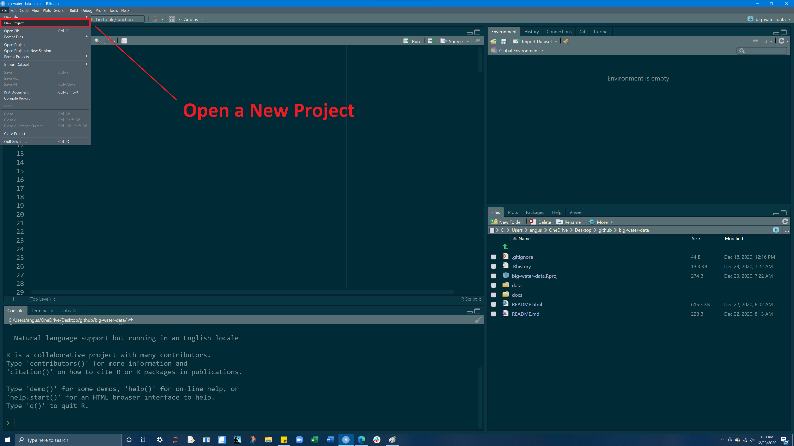
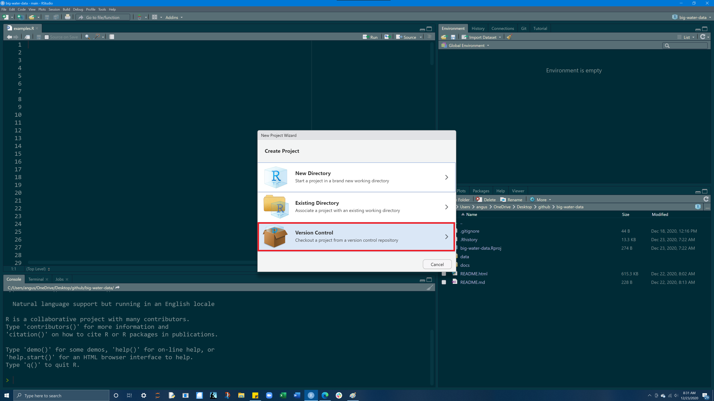
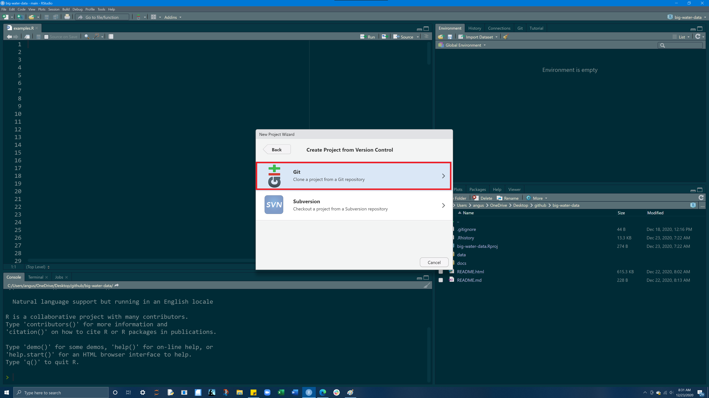
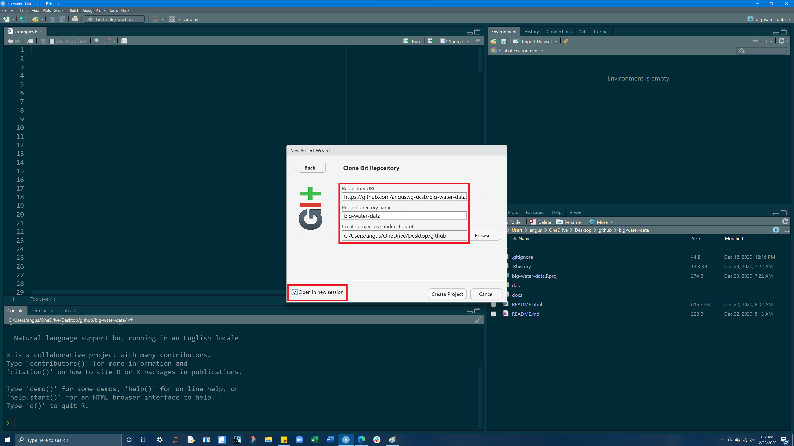

<style type="text/css">
span.code {
      background:rgba(240,128,128, 0.2);
      border-radius: 5px 5px 5px 5px;
      padding-left:5px;
      padding-top:2px;
      padding-right:5px;
      padding-bottom:2px;
      color:red;
     } 
</style>
***

> The RStudio terminal provides access to the **operating system (OS)** shell from within the RStudio IDE. Beneath the surface of any OS is an entire world that can only be accessed only from the **command line**. <br><br>The terminal is a gateway to that command line. <br><br>With it, instead of pointing and clicking, you can type commands and have your computer respond.


***

# **Goals**

- Brief crash course in terminal commands
- Overcome the initial (and understandable!) anxiety associated with the terminal
- Install git on your machine 
- Learn to execute simple tasks such as creating a file and navigating our system directory in the RStudio terminal
- Setup your Github account

***

# **Locate the Terminal**

The terminal is a computer application. On a Mac, it is most frequently accessed via your _Terminal_ application (do yourself a favor and download [iTerm](https://www.iterm2.com/)), and on Windows, through _PowerShell_. Fortunately, RStudio provides a built in terminal that imitates these applications within the RStudio IDE. The **Terminal** tab can be found next to the **Console tab**. If it is not visible, show it via `Shift+Alt+T` (or Tools > Terminal > New Terminal). Once visible, it should look something like this:




***

# **Useful Terminal Commands**

The terminal is a computer application. On a Mac, it is most frequently accessed via your Terminal application (do yourself a favor and download iTerm), and on Windows, through PowerShell. Fortunately, RStudio provides a built in terminal that imitates these applications within the RStudio IDE. The Terminal tab can be found next to the Console tab. If it is not visible, show it via Shift+Alt+T (or Tools > Terminal > New Terminal). Once visible, it should look something like this:

Entering commands into the terminal is useful for expediting basic tasks like file/folder creation. The terminal is also useful for exploring your file structure, and for retrieving information about your computer system. 

> Here are 6 common commands that are useful for navigating a file system and creating files.

<br>

## <span class= "code" >pwd</span> - print working directory

pwd displays directory or folder you are currently in

```{bash,  engine="sh"}
pwd
```

<br>

## <span class= "code" >ls</span> - list files

ls shows the files in the current working directory. This is equivalent to looking at the files in your Finder/Explorer/File Manager. Use ls -a to also list hidden files, such as `.Rhistory` and `.git`. Here we look at all the files in current working directory:

```{bash}
ls
```

<br>

## <span class= "code">mkdir</span> - make a directory

mkdir creates a new folder (directory) inside your current working directory

to make a new folder called 'my_folder'

```{bash}
mkdir my_folder
ls
```

Notably we see our my-folder directory!

<br>

## <span class= "code" >cd</span> - change directory

cd allows you to navigate through directories by changing working directory. There are many ways to navigate:

### go to subdirectory of current working directory:

```{bash}
pwd # start here
cd my-folder
pwd # end here
```

### go to parent (one folder up) of current working directory: cd ..

```{bash}
pwd
cd ..
pwd
```
### go to your “home” directory: cd ~ or simply cd

```{bash}
pwd
cd ~
pwd
```

### Using absolute path, works regardless of your current working directory:. 

```{bash}
pwd
cd /Users/anguswg-ucsb/github/spds
pwd
```

Windows uses a slightly different syntax with the slashes between the folder names reversed, \, e.g. cd C:\Users\MY_USERNAME\Desktop.

**Pro tip 1:** Dragging and dropping a file or folder into the terminal window will paste the absolute path into the window.

**Pro tip 2:** Use the tab key to autocomplete unambiguous directory and file names. Hit tab twice to see all ambiguous options.

<br>

## <span class= "code">touch</span> - create a file

On a MacOS or Linux machine (anything running Bash) <span class = "code">touch</span>  can be used to create a new file with a defined name and extension in the working directory. For example, we can create a new R file named `new_r_file.R` in our working directory as follows:

```{bash, eval = TRUE}
touch new_r_file.R
ls
```

On a Windows machine (anything running Powershell) <span class = "code">$null ></span>  can be used to create a new file with a defined name and extension in the working directory. Essentially, this is piping no data (null) into a new file. For example, we can create a new R file in our working directory as follows:

```{bash, eval = FALSE}
$null > new-r-file.R
```

<br>

## <span class= "code">clear</span> - clear your terminal window

```{r, eval = FALSE}
clear
```

```{bash, echo = FALSE}
rm -R my_folder
rm new_r_file.R
```


# **Installing git**

Now we are going to use our terminal to find/install git. But what is git?

<br>

> "Git is a free and open source, distributed, version control system designed to handle everything from small to very large projects with speed and efficiency."

<br> 

## Step 1. See if git is already installed

In your terminal, type the following (note: PC USERS type <span class = "code">where git</span>) and hit `Enter`.  

If `git` is installed, it will return a path like below. 

```{bash}
which git
```

If prompted to install git do it, if not process to Step 2 to manually install

If you have git installed, or it automatically installed, consider yourself fortunate and move to section 3. Otherwise...

## Step 2: Manually install git

<span class= "code">You should only have to do this if git was **NOT** found in Step 1 !!!</span>

### **MacOS <i class="fa fa-apple" aria-hidden="true"></i>**

Install the Xcode command line tools (not all of Xcode), which includes Git, by typing the following in your terminal:

```{bash, eval = FALSE}
xcode-select --install
```

### **Windows <i class="fa fa-windows" aria-hidden="true"></i>**

Install [Git for Windows](https://gitforwindows.org/), also known as “Git Bash”, to get Git and some other useful tools, such as the Bash shell. 

'Git for Windows' places the Git executable in the conventional location, which will help you and other programs (like RStudio) find and use it. 

When asked about “Adjusting your PATH environment”, make sure to select 
“_Git from the command line and also from 3rd-party software_”. Otherwise, accept the defaults unless you have **specific** reasons not to.

Once git is installed - restart RStudio and make sure that you can see the git pathway (which/where git) in the terminal. Once installed, continue to Step 3.

## Step 3: Check the version

Once you have git installed, enter `git --version` into your terminal to see the version of git you have. Like this:

```{bash}
git --version
```

# **Github**

> GitHub provides a platform for hosting software developed using Git. It offers the version control functionality of Git, plus its own features. While Git is a **command line tool**, GitHub provides a Web-based graphical interface. 

## <i class="fa fa-github" aria-hidden="true"></i> Your GitHub

 - Create an account on [GitHub](https://github.com) 
 - Choose your email and username wisely as it will appear on all websites and repositories you create
 - Take note of your user.name and email as we will need to reference them again shortly


## <i class="fa fa-search" aria-hidden="true"></i> Finding Open Source code

GitHub allows for us to find, borrow, and share open source. In the top left hand corner, enter`anguswg-ucsb/big-water-data` into the search bar to find your first repository




In the upper right hand corner you see three options:

1. **watch**: will notify you via email when changes to the repo are made (notifications can be a lot)
2. **star**: places the repo in “stared” repositories section making it convenient to find
3. **fork**: makes a copy of the current repo in your account that you can modify and build on


## <i class="fa fa-user" aria-hidden="true"></i> Telling Git who we are

You now have a local Git and a GitHub account, the next step is to connect them:

First, we need to tell git who we are. Git comes with a tool called `git config` that lets us set the configuration variables that control how Git looks and operates.

In the RStudio Terminal, enter the following, where `YOUR NAME` is what you want git to know you by (this can be your user.name or real name)

```{bash, eval = FALSE}
git config --global user.name 'YOUR NAME'
```

**What happened:** We used the terminal to the local Git program to set a global configuration variable, called **user.name** to the specified `YOUR NAME`

Next, we will do the same process to tell Git what `email` is associated with your new GitHub account
```{bash, eval = FALSE}
git config --global user.email 'Your Email Here'
```

After you have done both, enter the following into your terminal to list your global configuration variables:

```{bash, eval = TRUE}
git config --list --global
```

Make sure to check that your **user.name** and **user.email** are the same as what you inputted previously 

## <i class="fa fa-home" aria-hidden="true"></i> GitHub's local home

The last thing we will do is make a folder in our **home** directory named `github`. This is not a necessary step but it helps a lot to keep files organized and conveniently situated 

To do this, create a folder called `github` in the **home** directory of your computer. We can quickly do this by changing to our home directory (`cd`) and making a new folder (`mkdir`) called github:

```{bash, eval = FALSE}
cd ~
mkdir github
```

<br>
<br>

# **Forking + Cloning**

<br>

## Step 1 - Locate & Fork a repo 

> On GitHub, on the top left hand side type `anguswg-ucsb/big-water-data` into the search bar to find the repository for this course. 

> Now once we are at the repo, in the top-right corner of this page, click Fork.

> If you go to your GitHub page (`YOUR-USERNAME/big-water-data`), there will be your own version of this repo within your repositories


<br>
<br>

## Step 2 - Copy git URL

> From your GitHub (`YOUR-USERNAME/big-water-data`), go into your repositories and find the forked version of this repo.

> In the top right hand corner, click on the **green code** button and copy the git URL 



<br>
<br>
<br>
<br>

## Step 3 - Clone into RStudio to create a new project

<br>

`File --> New Project --> Version Control --> Git`

<br>
<br>

> Open a New Project



***

<br>
<br>
<br>
<br>

> Select Version control 



***

<br>
<br>
<br>
<br>

> Select git



<br>
<br>
<br>
<br>

>Paste the URL<br>Keep the name<br>Make as a subdirectory of `~/github`<br>Click open in new session



<br>
<br>
<br>

## <i class="fa fa-fork" aria-hidden="true"></i> So what did we just do?

 - forked a repo 
 - cloned our forked version onto our machine via RStudio
 - created a version control, git-enabled project! 
 - Now, you can make changes to this repo on your computer, and push the changes to GitHub 


  


> **Congratulations!!**<br>We just went through a lot of steps, and it can be overwhelming the first few times dealing with the RStudio terminal, git, GitHub and this forking and cloning business. If you continue using RStudio and GitHub, before  before you know it, forking and cloning repositories will be something you can do without thinking


Go ahead and inspect the folders/files in the project. What did you find? 

All projects will typically contain 3 folders:  `docs, data, img` 


<br>
<br>
<br>
<br>


# **Assignment**

<br>

**1. Screenshot of your git config global variables (e.g.)**

```{bash, eval = FALSE}
git config --list --global
```

<br> 

**2. a URL to your github account (e.g.) **

```{r, eval = FALSE}
https://github.com/anguswg-ucsb
```
 
<br> 

**3. All projects will typically contain 3 folders: docs, data, img**

<br>

- Go ahead and inspect the files in each folder. 

- What did you find?

- What type of files are in each folder? 

- What happens when you try to open the differnt file types?


<br>
<br>
<br>


## **END**

