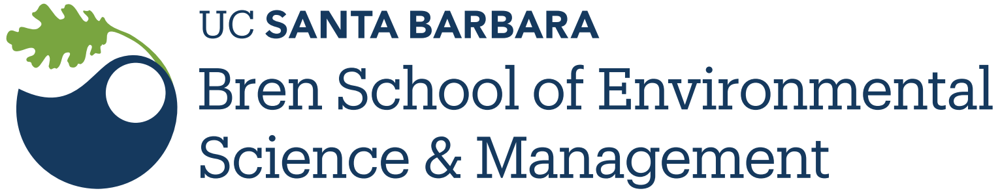

```{r, echo = FALSE, warning=FALSE, message=FALSE}
library(rmarkdown)
library(mikedown)
#
```

# **Welcome to ES - Data & Water**

***

This is home page **ES - Big data and water class** for the Winter 2021 quarter, offered at UCSB. The course is taught by Professor D. Perrone from the Bren School of Environmental science at UCSB. 

Data science allows us to analyze and parse through data and eventually draw conclusions. In the real world, data very rarely "friendly" and needs to be coerced and manipulated before any meaningful analysis can take place. This course will be taught in R but no prior knowledge of the language is needed! Prior experience in other programming languages will benefit you but is not necessary.

<br>

***

> **"The purpose of programming is to find a sequence of instructions that will automate the performance of a task on a computer, to solve a given problem."**


