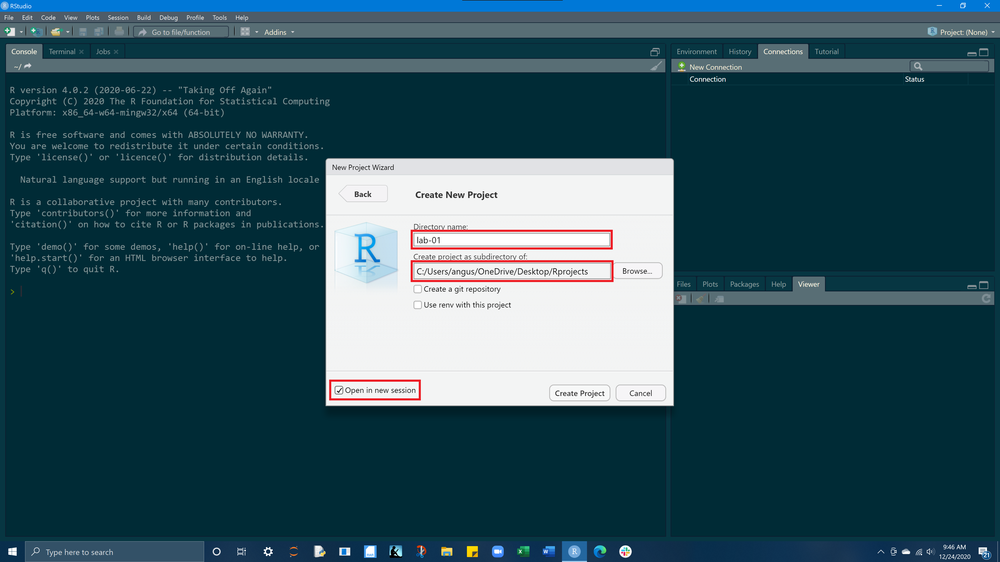
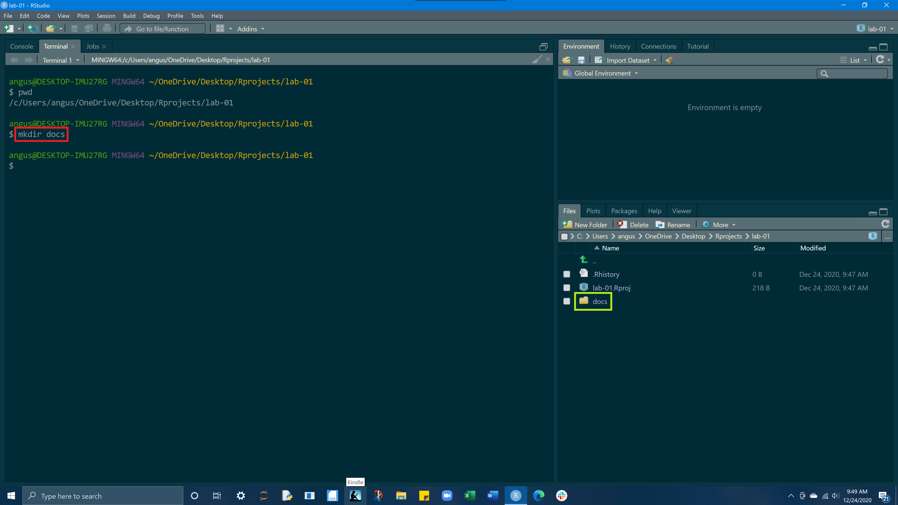
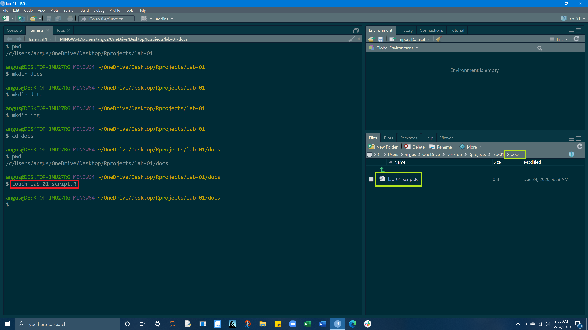
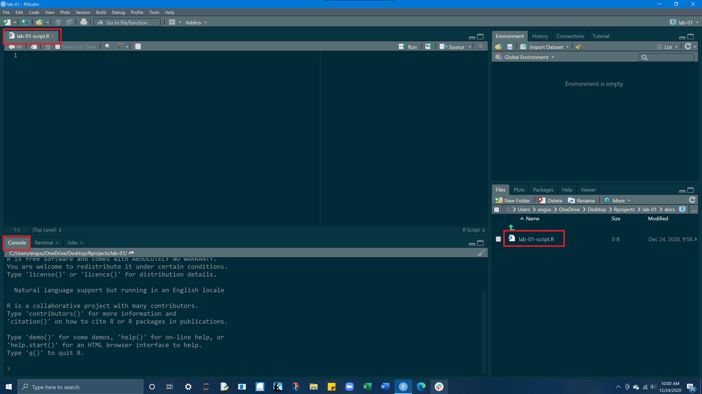

<style type="text/css">
span.code {
      background:rgba(240,128,128, 0.2);
      border-radius: 5px 5px 5px 5px;
      padding-left:5px;
      padding-top:2px;
      padding-right:5px;
      padding-bottom:2px;
      color:red;
     } 
</style>
***

# **Goals**

- Make a folder for this class that will be the home for all your projects
- Learn how to make a new project in RStudio and build a reproducible & organized file structure within a project
- Learn to execute simple tasks within the RStudio terminal to create files and navigate our system directory
- Overcome the initial (and understandable!) anxiety associated with the terminal
- Install packages and load them into your environment
- Explore the basics of RStudio
- Understand the different data types & data structures in R
- Get comfortable working with the different data types & data structures

***

# **Create a folder for this class**

### **MacOS <i class="fa fa-apple" aria-hidden="true"></i>**

First, we will create a new folder on our desktop that we'll use to organize our RStudio projects for this class. 
Navigate to your desktop, and right click and click `New folder`. A new folder should appear on your desktop, to rename the folder, double click on the folder's name and give it the name `Rprojects`

### **Windows <i class="fa fa-windows" aria-hidden="true"></i>**

On windows, do the same thing but when you right click on the desktop hover over `New` and the click `Folder` 


***

# **Create a new project in RStudio**

> Open RStudio and click on `File` in the top left hand corner of the page, and then select `New Project`


<br>
<br>

> Select `New Directory`


<br>

> Select `New Project`


<br>

>Under `directory name` enter **Lab-01**<br>Under `create project as subdirectory of` select browse and find and select the ***Rprojects*** folder you created on your desktop<br>Check the `Open in new session` box in the bottom left hand corner<br>After entering the above information, select `Create Project`<br> RStudio will automatically open the new project,  you can also access your `lab-01.Rproj` from your Rprojects folder on your desktop.




***


# **Build a project file structure**


> Now we are going to create a simple file structure to help keep our project organized. We will populate our project with `docs`, `data`, and `img` folders. We will do this via the terminal

The terminal is a computer application. On a Mac, it is most frequently accessed via your Terminal application (do yourself a favor and download iTerm), and on Windows, through PowerShell. Fortunately, RStudio provides a built in terminal that imitates these applications within the RStudio IDE. **The Terminal tab can be found next to the Console tab. If it is not visible, show it via Shift+Alt+T (or Tools > Terminal > New Terminal).** Once visible, it should look something like this

***The terminal is a gateway to that command line. With it, instead of pointing and clicking, you can type commands and have your computer respond. Entering commands into the terminal is useful for expediting basic tasks like file/folder creation. The terminal is also useful for exploring your file structure, and for retrieving information about your computer system.***

<br>

## **Terminal layout**

>The <span class = "code">terminal</span> and the <span class = "code">files tab</span> are highlighted red and the project's `current working directory`is in yellow. 


<br>

## <span class= "code" >pwd</span> - print working directory

pwd displays the directory or folder you are currently in

My working directory is `/c/Users/angus/OneDrive/Desktop/Rprojects/lab-01`, yours will be slightly different but essentially the same


<br>

## <span class= "code">mkdir</span> - make a directory

mkdir creates a new folder (directory) inside your current working directory<br>Entering <span class = "code">mkdir docs</span> into the terminal, will create a docs folder within our current working directory.<br>Go ahead an make docs, data, and img folders in your project.<br> In the bottom right hand pane, select File from the top row of tabs, you should now see your docs, data, and img folders. 

These 3 folders will hold all the components of your project.<br>The docs folder is for your Rscript (.R) and Rmarkdown (.Rmd) files, the data folder is for your .CSV, .xls, .txt files, and the img folder is for images you may use or create from within the project.


<br>

>**mkdir docs**



<br>

>**mkdir data**


<br>

>**mkdir img**


<br>

## <span class= "code" >cd</span> - change directory

cd allows you to navigate through directories by changing working directory. 

There are many ways to navigate using <span class = "code">cd</span> but today we will only need `cd "the folder (directory) you want to move to"` and `cd ..`<br>The first command takes us from our current working directory and by entering `cd docs` we move into our docs folder<br><span class = "code">cd ..</span> will reverse this and step back a directory<br>We are doing this because the next thing we will do is create a file in our docs folder!


<br>
<br>

***

# **Create a R Script**

## <span class= "code">touch</span> - create a file

On a MacOS or Linux machine (anything running Bash) <span class = "code">touch</span>  can be used to create a new file with a defined name and extension in the working directory. For example, we can create a new R file named `lab-01-script.R` in our working directory as follows.<br> You should now see an Rscript (.R) file in your docs folder



<br>

>Open your lab-01-script.R file and then in the bottom left hand quadrant where our terminal is, select `Console` from the tab row above.




***

<br>
<br>

# **Load in your libraries**

<br>


***

<br>
<br>

# **Data types**

Values in R can be one of 6 different types :

>1. numeric (e.g. `2`, `2.15`) - values w/ decimals<br>2. integer (e.g. `2L`) - values w/o decimals (create w/ uppercase 'L')<br>3. character (e.g. `"x"`, `"Welcome!"`)<br>4. logical (e.g. `TRUE`, `FALSE`)<br>5. raw (e.g. holds `bytes`)<br>6. complex (e.g. `1+4i`) - _we are going to ignore_

The `class` function tells us what kind of object is it (high-level)
The `typeof` function can tell us the object’s data type (low-level)

What's the difference between 3 (the number) and '3' (the character)?

## Numeric
```{r,eval= TRUE}
x = 3  
y = 3*400 
z = 1 + 3

class(3) # numeric
class(3*400) # integer
class(1 +3) # character
class(x) # character
class(y) # logical 
class(z) 
```

## Integer
```{r,eval= TRUE}
x = 3  
y = 3*400 
z = 1 + 3

class(3) # numeric
class(3*400) # integer
class(1 +3) # character
class(x) # character
class(y) # logical 
class(z) 
```

## Character
```{r,eval= TRUE}
x = "a"  
y = "bc"  
z = "GIS is Great!!!"
class(3) # numeric
class(3L) # integer
class('3') # character
class(x) # character
class(TRUE) # logical 

```

## Missing Values (NA)

>Missing values still need a place holder<br>Missing values are denoted with NA (short for not applicable).<br>Missing values are 'infectious': most computations involving a missing value will return another missing value.

```{r,eval= TRUE}
vec = c(5,6,7,8,NA)  
mean(vec)  
mean(vec, na.rm = TRUE)

x = c(NA, 50, NA, 9)  
x == NA  
is.na(x)

```

***

# **Data structures**


## Vectors

>Can created using the c() (combine) function<br>The length can be checked with length()

```{r}
a <- c(1,2,5.3,6,-2,4) # numeric vector
b <- c("one","two","three") # character vector
c <- c(TRUE,TRUE,TRUE,FALSE,TRUE,FALSE) #logical vector
```

## Lists

An ordered collection of objects (components). A list allows you to gather a variety of (possibly unrelated) objects under one name. Extends vectors and allows elements to be any type

```{r}
list = list(
  1:5, 
  "water_level", 
  c(TRUE, FALSE, TRUE), 
  c(2.3, 5.9)
)

list[[1]]
list[[2]]
list[[3]]
list[[4]]


typeof(list)
```


## Dataframes

- a named list of vectors.

- data.frames are one of the biggest and most important ideas in R, and one of the things that make R different from other programming languages

- Unlike a regular list, in a `data.frame`, the length of each vector must be the same.

```{r}

df <- data.frame(state = c("California", "Arizona", "Texas"),  
                  size_rank  = c(1,3,2),  
                  pop = c(T,F,F))  
typeof(df)  
attributes(df)  
str(df)

dim(df) #3 objects by 3 variables

```


> Subsetting a dataframe 

```{r}

df[1,2]  
df[2,]  

df[[1]][1] 

df$state[1] # first row in column state
df$pop[2] # second row in column pop

df[1:2] # columns 1, 2 of dataframe
```

### Car examples

> R comes with several preloaded data sets<br>mtcars is a list of Motor trend cars<br>running `data()` will show the list of avaliable datasets

```{r}
#preview dataset
head(mtcars,3)  

# Get data diminsions
dim(mtcars)  
str(mtcars)  
mtcars$name[1:5]  
mtcars[[1]][1:5]  
mtcars[1:5,1:5]

```
***

# **Useful Terminal Commands**

The terminal is a computer application. On a Mac, it is most frequently accessed via your Terminal application (do yourself a favor and download iTerm), and on Windows, through PowerShell. Fortunately, RStudio provides a built in terminal that imitates these applications within the RStudio IDE. The Terminal tab can be found next to the Console tab. If it is not visible, show it via Shift+Alt+T (or Tools > Terminal > New Terminal). Once visible, it should look something like this:

Entering commands into the terminal is useful for expediting basic tasks like file/folder creation. The terminal is also useful for exploring your file structure, and for retrieving information about your computer system. 

> Here are 6 common commands that are useful for navigating a file system and creating files.

<br>

## <span class= "code" >pwd</span> - print working directory

pwd displays directory or folder you are currently in

```{bash,  engine="sh"}
pwd
```

<br>

## <span class= "code" >ls</span> - list files

ls shows the files in the current working directory. This is equivalent to looking at the files in your Finder/Explorer/File Manager. Use ls -a to also list hidden files, such as `.Rhistory` and `.git`. Here we look at all the files in current working directory:

```{bash}
ls
```

<br>

## <span class= "code">mkdir</span> - make a directory

mkdir creates a new folder (directory) inside your current working directory

to make a new folder called 'my_folder'

```{bash}
mkdir my_folder
ls
```

Notably we see our my-folder directory!

<br>

## <span class= "code" >cd</span> - change directory

cd allows you to navigate through directories by changing working directory. There are many ways to navigate:

### go to subdirectory of current working directory:

```{bash}
pwd # start here
cd my-folder
pwd # end here
```

### go to parent (one folder up) of current working directory: cd ..

```{bash}
pwd
cd ..
pwd
```
### go to your “home” directory: cd ~ or simply cd

```{bash}
pwd
cd ~
pwd
```

### Using absolute path, works regardless of your current working directory:. 

```{bash}
pwd
cd /Users/anguswg-ucsb/github/spds
pwd
```

Windows uses a slightly different syntax with the slashes between the folder names reversed, \, e.g. cd C:\Users\MY_USERNAME\Desktop.

**Pro tip 1:** Dragging and dropping a file or folder into the terminal window will paste the absolute path into the window.

**Pro tip 2:** Use the tab key to autocomplete unambiguous directory and file names. Hit tab twice to see all ambiguous options.

<br>

## <span class= "code">touch</span> - create a file

On a MacOS or Linux machine (anything running Bash) <span class = "code">touch</span>  can be used to create a new file with a defined name and extension in the working directory. For example, we can create a new R file named `new_r_file.R` in our working directory as follows:

```{bash, eval = TRUE}
touch new_r_file.R
ls
```

On a Windows machine (anything running Powershell) <span class = "code">$null ></span>  can be used to create a new file with a defined name and extension in the working directory. Essentially, this is piping no data (null) into a new file. For example, we can create a new R file in our working directory as follows:

```{bash, eval = FALSE}
$null > new-r-file.R
```

<br>

## <span class= "code">clear</span> - clear your terminal window

```{r, eval = FALSE}
clear
```

```{bash, echo = FALSE}
rm -R my_folder
rm new_r_file.R
```
