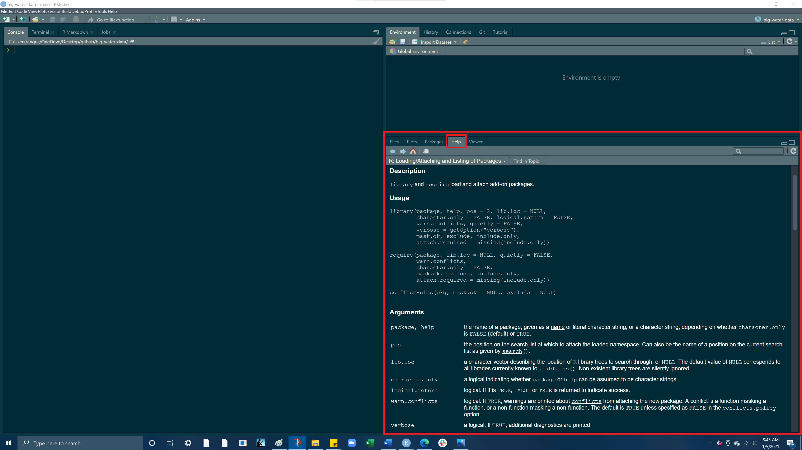

<style type="text/css">
span.code {
      background:rgba(240,128,128, 0.2);
      border-radius: 5px 5px 5px 5px;
      padding-left:5px;
      padding-top:2px;
      padding-right:5px;
      padding-bottom:2px;
      color:red;
     } 
</style>
***


# **Goals**

- Work within an RScript file (.R)
- Load libraries into an RScript (tidyverse & here)
- Read a .csv data file into an RScript
- Explore different data types and structures in R


***

# **Before we start:**

- Open up your lab-02 Rproject from your Rprojects folder
- Download the  `export.csv` file from GauchoSpace and save it to the `data` folder in your `lab-02 Rproject`
- Then open your `lab-02-script.R` file from your `docs` folder
- At the top of your Rscript, type the `#` and then type your name, the course name, lab 2, and the date afterwords


The **hash symbol `#`** is used to **"comment out"** text in your RScript so R does not run it as code. It is good practice to get used to using the `#` to label your code and describe your process. It helps you remember what certain code is doing and it also helps someone viewing your code to understand your process 

```{r}
# Angus Watters
# ENVS 193 - Professor Perrone
# Lab 2
# 1/4/2021
```

# **Load in libraries**
- In this lab, we will be using the `tidyverse` and `here` packages 
- Load these libraries in by using the `library()` function 

```{r, message=FALSE, warning = FALSE, eval=TRUE}
library(tidyverse)
library(here)
```


## **help() function**
- the help() function is a very useful tool for understanding what a function does and what inputs it takes. 
- When you call the help function, the help page for the function you called will appear in the bottom right pane
- At the bottom of the help page you will find code examples for that function, you can run these yourself to get an idea of how to use a function!
- As you go through this lab, use the `help()` function to get more information on the functions we will be using
- You can access the help documentation for any function by entering the function into the `help()` function like so:

```{r,message=FALSE, warning = FALSE, eval=FALSE}
help(library) # calling help for the library() function
```




# **Read in a .csv file using here()**

- Click here to download a .csv file of water data ADD LINK TO CSV DATA
- Once the file downloads, save it into the `data folder` in your project directory. 
- Now lets read that .csv file into our Rscript using the `read_csv()` function and the `here()` function

<br>
- `here()` allows you to locate files relative to your project root. It finds files based on the current working directory at the time when the package is loaded. This means that if someone else would like to run your code, the file path will adjust to that persons current working directory, giving them a file path to the data. Using here() is good practice as it allows for a  reproducible file path for whoever is using the code. ***Reproducible code and work flows allows you to cut down on extra coding in the future and saves time in the long run for you and anyone else who might want to use your code. ***

My current working directory when I loaded the `here` package
```{r}
here()
```

<br>

So to access the `export.csv` file in our data folder we need to get to<br> **"C:/Users/angus/OneDrive/Desktop/github/big-water-data/data/export.csv"**<br>
here() will give us an easy way of finding this path

```{r}
here("data/export.csv")
```
<br>
```{r, message=FALSE, warning = FALSE}
read_csv(here("data/export.csv"))
```

Run this code and you'll notice the dataframe outputs to our console. 
How do we save this dataframe to a variable so we can conveniently access again.

<br>

# **Variables** 

Lets create a variable named `water_df` and assign it to our .csv file!

```{r, message=FALSE, warning = FALSE}
water_df = read_csv(here("data/export.csv"))
```

<br>
<br>

If you look at your environment (top right pane) you should see a variable called `water_df` which has 1 observation of 14 different variables!

<br>

Now run `water_df` in your Rscript or your console you should see this:

```{r}
water_df
```

Before getting into the data within our data frame lets just quickly look at different data structures within R


# **Data Structures** 


## **Vectors**

- Vectors can be created using the `c()` (combine) function
- The length can be checked with `length()`


### **Character vector**

Let's use `c()` to make a **character vector** of different water demand sectors
```{r}
water_demands = c("Public Supply", "Domestic", "Industrial")
water_demands
```
<br>

### **Numeric vector**
Now let's use `c()` to make a **numeric vector** detailing the volume of water use for each of these sectors
```{r}
water_use = c(49.94, 0.52, 6.36)
water_use
```
<br>

### **Adding elements to a vector**

If we wanted to add **Irrigation** to our `water_demands` vector, we would need to surround **Irrigation** in quotes to create a character string, as to match the data type of the other elements in the `water_demands` vector. 
```{r}
water_demands = c(water_demands, "Irrigation")
water_demands
```
<br>

To add the volume of water use by **Irrigation** we can do the same thing but because this is a numeric vector we do not need to use quotation marks

```{r}
water_use = c(water_use, 55.95)
water_use
```

### **Subsetting a vector**

To subset a vector we use `[]`, this is known as indexing. Each element in a vector has an index based on its order in the vector.

<br>
If we want to retrieve only the 3rd element we would put a 3 in the brackets to "index the 3rd element"
```{r}
water_demands[3]

```
<br>

If you want to **remove an element from a list,** while keeping all the other elements, you can use the a **negative**. The following removes just the 3rd element from the list and returns a vector of the remaining elements 
```{r}
water_demands[-3] 
```
<br>

If you want to get a range of elements from a vector use the `:`. The structure of this method is `vector[startingElement:endingElement]`
```{r}
water_demands[1:3] 
```

<br>

## **Lists**

An ordered collection of objects (components). A list allows you to gather a variety of (possibly unrelated) objects under one name. Extends vectors and allows elements to be any type
- the `list()` function lets you create a list 
- Let's input the values we used to create our `water_demands` and `water_use` vectors into a list


```{r}
list = list(
  c("Public Supply", "Domestic", "Industrial"), 
  c(49.94, 0.52, 6.36))
```
<br>

But because we have already created vectors containing these values, a more efficient way of making this same list would be to call our vectors directly into `list()`
```{r}
list2 = list(
  water_demands, 
  water_use)
```

<br>
Use the `class()` function on our `list2` variable, to check what type of data structure `list2` is
```{r}
class(list)
```

<br>

### **Subsetting a list**
The content of elements of a list can be retrieved by using double square brackets `[]`

<br>

Here if we call `list2[[1]]` we will be returning the first list element, `water_demands`
```{r}
list2[[1]]
```
<br>
Then if we want to get a certain element from within our first list element `water_demands` we can use the same indexing we used with vectors<br>So within our first list element we want the object in index `[1]`
```{r}
list2[[1]][1]
```
<br>
We can do the same thing with the second list element, `water_use`
```{r}
list2[[2]]
```
<br>
```{r}
list2[[2]][2]
```
<br>

If we wanted to **name the two elements of our list we can use the `names()` function.**<br> To use the `names()` function you have to supply a vector with your desired names and this vector must have the same number of elements as the length of your list.<br>To check our lists length we can use the `length()` function

```{r}
length(list2)
```
So we see our list has a length of 2, therefore if we want to assign names to our list we need to supply a vector with 2 names.
<br>
```{r}
names(list2) = c('sector', 'water_volume')
list2
```
Now we have a list with 2 elements named `sector` and `water_volume` respectively.
<br>
**What if we wanted to match the element by index?** That is we want the element in index 1 of the first vector to match with the element in index 1 of the second vector.<br> The function `bind_rows()` allows us to take the 2 vector sequences in `list2` and bind the rows together, so index 1 in `water_demands` becomes row 1, column1 and index 1 in  `water_use` becomes row 2, column1, thus matching. 

```{r}
binded_row_list = bind_rows(list2)

```

If you assign `bind_rows(list2)` to a new variable `binded_row_list` and hit run. You will notice we have a new object in our environment!
<br>
Use the `class()` function on your `binded_row_list` object and what do you get?

***

<br>
<br>

## **Dataframes**

- a named list of vectors.

- data.frames are one of the biggest and most important ideas in R, and one of the things that make R different from other programming languages

- Unlike a regular list, in a `data.frame`, the length of each vector must be the same.

- typically dataframes are read into R via `read_csv`, `read_table`, or `read_xls`, depending on the file type 

- dataframes can also be built using the `data.frame()`function

### **Useful dataframe function**

- `head()` - shows first 6 rows
- `tail()` - shows last 6 rows
- `dim()` - returns the dimensions of data frame (i.e. number of rows and number of columns)
- `nrow()` - number of rows
- `ncol()` - number of columns
- `str()` - structure of data frame - name, type and preview of data in each column
- `names()` or `colnames()` - both show the names attribute for a data frame

***Lets now inspect different qualities of this dataframe***

<br>

### **Structure of a dataframe**


If we use the `class()` function on our dataframe we see that it is a `tbl_df`, a **tibble** is very similar to a dataframe, but it also displays the type of data underneath each column heading name 

```{r}
class(water_df)
```

<br>

And here is our dataframe. 
The data frame is 1 observation (rows) by 14 variables (columns)<br>Notice the `num` classification next to all of the columns, this is indicating the type of data in each column
```{r}
str(water_df) 
```

<br>

### **Subsetting a dataframe**
- We can subset our dataframe and look at specific rows or columns by using `[]` or `$`
- To subset with brackets the structure is `dataframe[row, column]`
- To subset using the $ the structure is `dataframe$column`


So if we call `water_df[1,2]` we will get the first row and second column of our dataframe
```{r}
water_df[1,2]  # row 1, column 2
```
<br>

If we call just `water_df[1,]` we will get the entire first row with all the columns of our dataframe
```{r}
water_df[1,]  # row 1, column 2
```

<br>

You can use `:` to subset a range of columns, the structure to do this is `dataframe[column1:column(n)]`
```{r}
water_df[1:4]
```

<br>


Let's subset the first row and the second column using the `$`
```{r}
water_df$"Public Supply"[1]
```

And then the fourth column and all the rows (we only have 1 row in our dataframe so we will only get the first row)

```{r}
water_df$Industrial
```
You'll notice when we wanted to subset the first row and second column, `water_df$"Public Supply"[1]` we had to use quotations around the column name, but we didnt need to do this in the following example, `water_df$Industrial`. This is because the "Public Supply" has column has a space between the two words. 

**Try running the same code without the quotations and see what happens. **

**Did you receive an error?**

>The reason for this is because the **"Public Supply"**  column has a space between the two words, this space needs to be acknowledged by R, this can be accomplished by adding the quotations, indicating everything in the quotes is the column name. We didn't need to do this with the `water_df$Industrial` call as the column **"Industrial"** is all one word. This is one reason why it is important to be careful when naming data frame. Typically it is best to avoid spaces and instead it utlize the `_` character in place of a space. 


# **Data types**

Values in R can be one of 6 different types :

  1. **numeric** (e.g. 2, 2.15) - values w/ decimals<br>2. **integer** (e.g. 2L) - values w/o decimals (create w/ uppercase 'L')<br>3. **character** (e.g. "x", "Welcome!")<br>4. **logical** (e.g. TRUE, FALSE)<br>5. **raw** (e.g. holds bytes)<br>6. **complex** (e.g. 1+4i) - _we are going to ignore_
  
>For this class we will be focused on **numeric** and **character** data types

The `class()` function tells us what kind of object is it (high-level)<br>The `typeof()` function can tell us the object’s data type (low-level)


<br>

<br>

## **Numerics**

>***Let's look at what data types are in our `water_df` dataframe we created***

THe data type for the values in the `Public Supply` column
```{r}
class(water_df$"Public Supply")
```

<br>

And for the `Industrial` column

```{r}
class(water_df$Industrial)
```

All of our columns contain `numeric` data types but you will encounter situations where you may have a column with character data types that you wish to be numeric, and vice versa. 

<br>

**The following example shows why this is important to know**

Lets say we had country information on domestic and agricultural water use in some objects:

```{r}
country = "Mexico"
domestic_water_use = 146
agricultural_water_use = 74
```

<br>

If we wanted to we could add `domestic_water_use` and `agricultural_water_use` and get an answer

```{r}
domestic_water_use + agricultural_water_use
```

<br>

But what if we try and add `domestic_water_use` and `country`?

```{r, error = TRUE}
domestic_water_use + country
```

This `non-numeric argument error` is saying that one of these objects is not a **numeric value** (country is a character value)

For whatever reasons, you will encounter data that has discrepencies like this and thus why it is good to look at the structure of whatever dataframe you're working with.

***

**What's the difference between `2012` (the number) and `'2012'` (the character)?**

```{r,eval= TRUE}
class(2012) # numeric
```
<br>

```{r,eval= TRUE}
class('2012') # character
```
When you surround a something in quotes (double or single), that element is coerced to the class of character, as shown above as the numeric 3 becomes a character once wrapped in quotes


