<style type="text/css">
span.code {
      background:rgba(240,128,128, 0.2);
      border-radius: 5px 5px 5px 5px;
      padding-left:5px;
      padding-top:2px;
      padding-right:5px;
      padding-bottom:2px;
      color:red;
     } 
</style>
***

# **Goals**

- Make a folder for this class that will be the home for all your projects
- Learn how to make a new project in RStudio and build a reproducible & organized file structure within a project
- Learn to execute simple tasks within the RStudio terminal to create files and navigate our system directory
- Overcome the initial (and understandable!) anxiety associated with the terminal
- Install packages and load them into your environment
- Explore the basics of RStudio
- Understand the different data types & data structures in R
- Get comfortable working with the different data types & data structures

***

# **Create a folder for this class**

### **MacOS <i class="fa fa-apple" aria-hidden="true"></i>**

First, we will create a new folder on our desktop that we'll use to organize our RStudio projects for this class. 
Navigate to your desktop, and right click and click `New folder`. A new folder should appear on your desktop, to rename the folder, double click on the folder's name and give it the name `Rprojects`

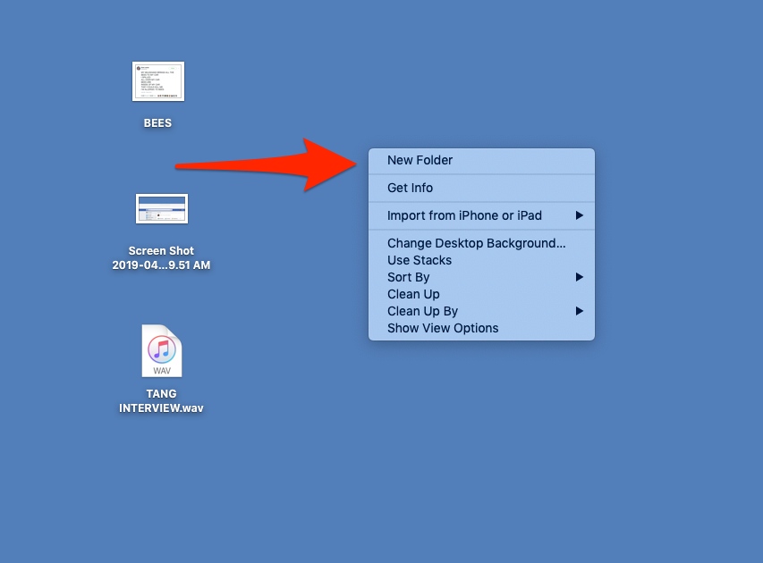
<br> 
<br> 

### **Windows <i class="fa fa-windows" aria-hidden="true"></i>**

On windows, do the same thing but when you right click on the desktop hover over `New` and the click `Folder` 


<br>
<br>

**Next open RStudio, if you do not see RStudio on your desktop you can open it by searching RStudio**

**On a Mac**, in the the top right hand corner of your screen select the magnifiying glass icon and enter RStudio

**On windows**, in the bottom left hand corner of your screen enter RStudio into the search box with the magnifying glass

# **Create a new project in RStudio**

> **Open RStudio and click on `File` in the top left hand corner of the page, and then select `New Project`**

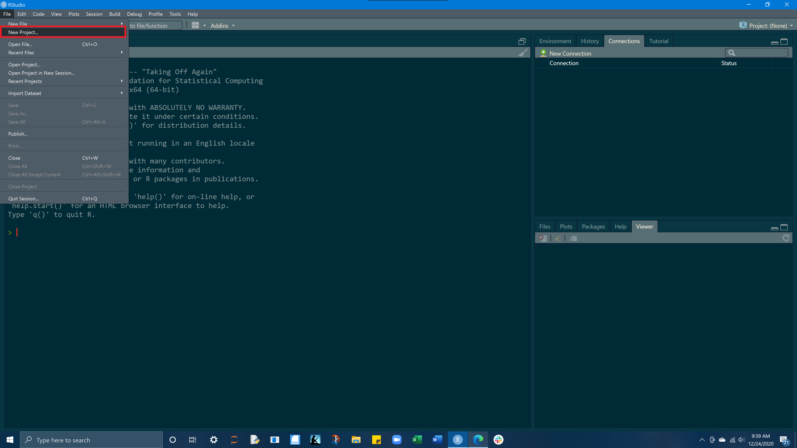

<br>
<br>

> **Select `New Directory`**

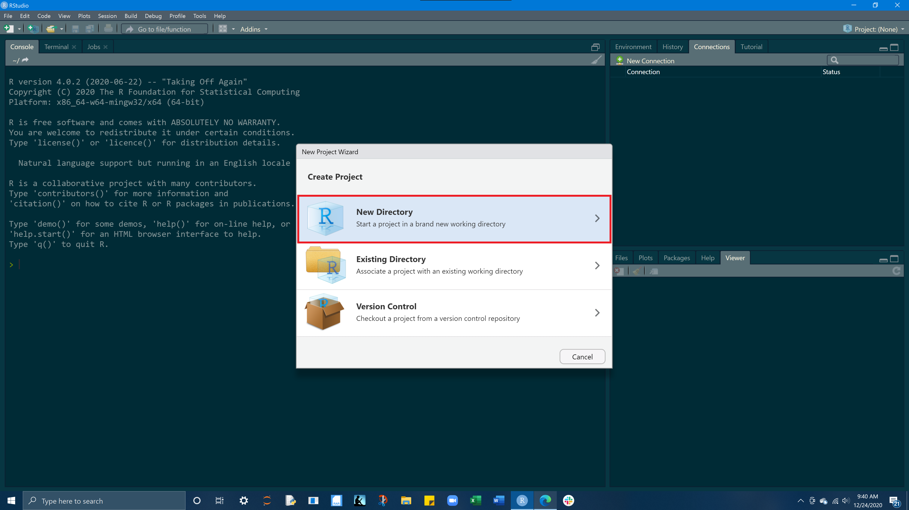

<br>

> **Select `New Project`**

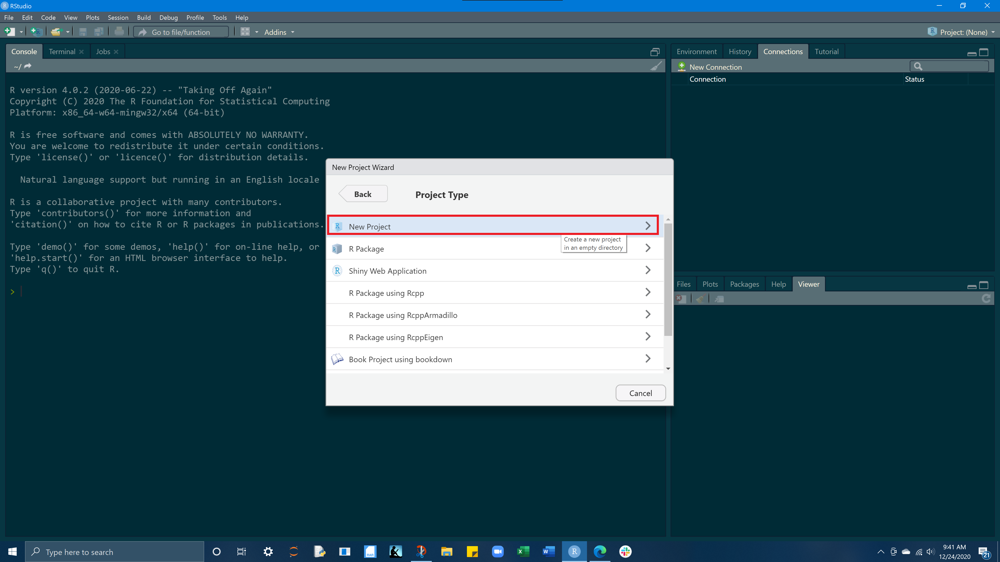

<br>

>For `directory name` enter **Lab-01**<br>Under `create project as subdirectory of` select browse and find and select the ***Rprojects*** folder you created on your desktop<br>Check the `Open in new session` box in the bottom left hand corner<br><br>After entering the above information, select `Create Project`,<br>***RStudio will automatically open the new project,  you can also access your `lab-01.Rproj` from your Rprojects folder on your desktop.***

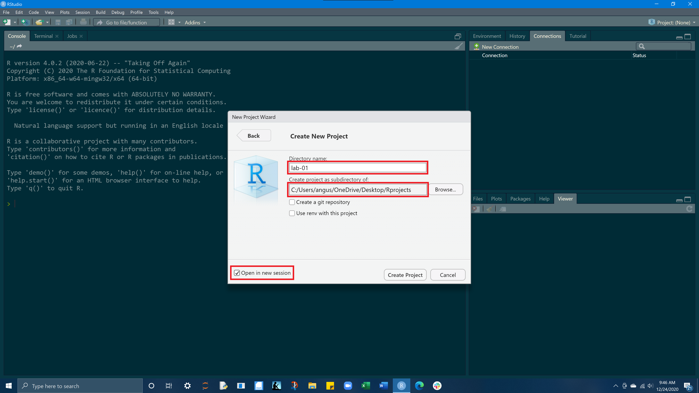


***


# **Build a project file structure**


> Now we are going to create a simple file structure to help keep our project organized. We will populate our project with `docs`, `data`, and `img` folders. We will do this via the terminal

The terminal is a computer application. On a Mac, it is most frequently accessed via your Terminal application (do yourself a favor and download iTerm), and on Windows, through PowerShell. Fortunately, RStudio provides a built in terminal that imitates these applications within the RStudio IDE. **The Terminal tab can be found next to the Console tab. If it is not visible, show it via Shift+Alt+T (or Tools > Terminal > New Terminal).** Once visible, it should look something like this

***The terminal is a gateway to that command line. With it, instead of pointing and clicking, you can type commands and have your computer respond. Entering commands into the terminal is useful for expediting basic tasks like file/folder creation. The terminal is also useful for exploring your file structure, and for retrieving information about your computer system.***

<br>

## **Terminal layout**

>The <span class = "code">terminal</span> and the <span class = "code">files tab</span> are highlighted red and the project's `current working directory`is in yellow. 

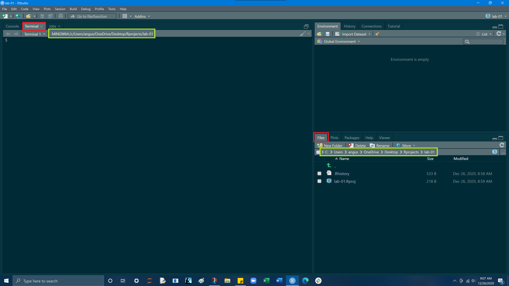

<br>

## <span class= "code" >pwd</span> - print working directory

pwd displays the directory or folder you are currently in

My working directory is `/c/Users/angus/OneDrive/Desktop/Rprojects/lab-01`, yours will be slightly different but essentially the same

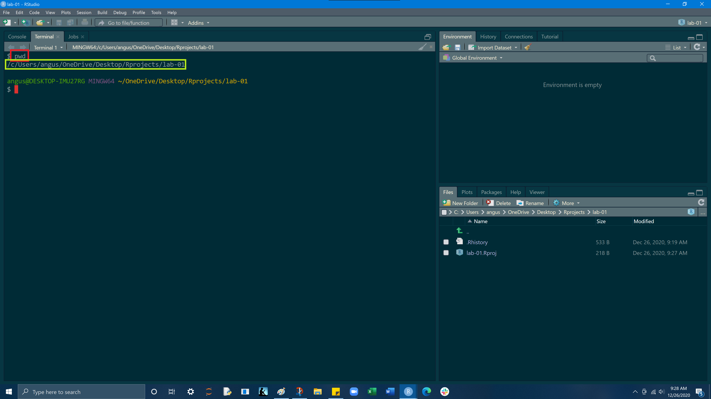

<br>

## <span class= "code">mkdir</span> - make a directory

mkdir creates a new folder (directory) inside your current working directory<br>Entering <span class = "code">mkdir docs</span> into the terminal, will create a docs folder within our current working directory.<br>Go ahead an make docs, data, and img folders in your project.<br> **In the bottom right hand pane, select File from the top row of tabs, you should now see your docs, data, and img folders**

These 3 folders will hold all the components of your project.<br>The docs folder is for your Rscript (.R) and Rmarkdown (.Rmd) files, the data folder is for your .CSV, .xls, .txt files, and the img folder is for images you may use or create from within the project.


<br>

>**mkdir docs**

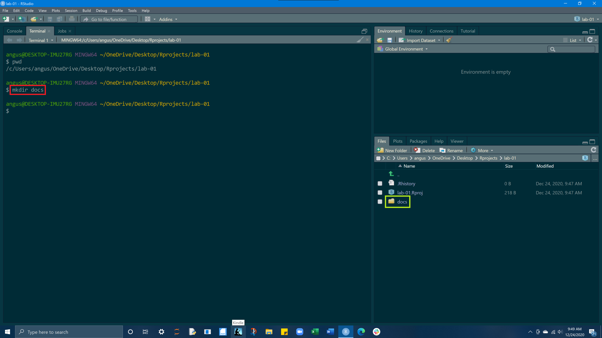

<br>

>**mkdir data**

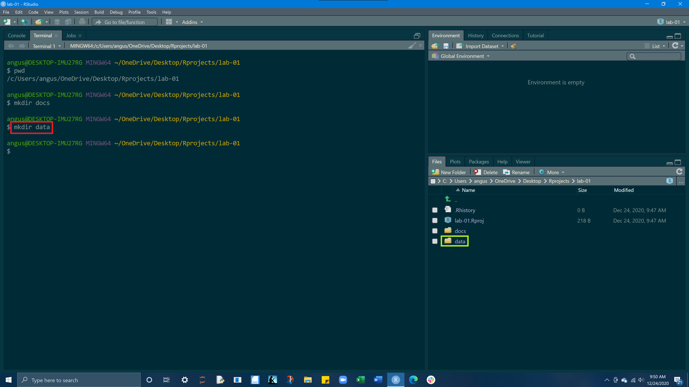

<br>

>**mkdir img**

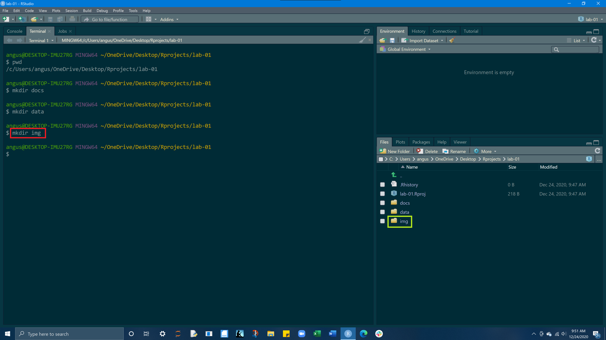

<br>

## <span class= "code" >cd</span> - change directory

cd allows you to navigate through directories by changing working directory. 

There are many ways to navigate using <span class = "code">cd</span> but today we will only need `cd "the folder (directory) you want to move to"` and `cd ..`<br>The first command takes us from our current working directory and by entering `cd docs` we move into our docs folder<br><span class = "code">cd ..</span> will reverse this and step back a directory<br>We are doing this because the next thing we will do is create a file in our docs folder!


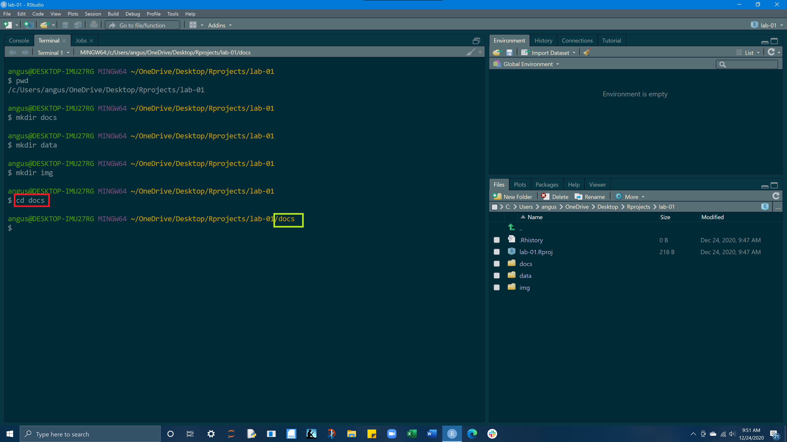

<br>
<br>

***

# **Create a R Script**

## <span class= "code">touch</span> - create a file

On a MacOS or Linux machine (anything running Bash) <span class = "code">touch</span>  can be used to create a new file with a defined name and extension in the working directory. For example, we can create a new R file named `lab-01-script.R` in our working directory as follows.<br> You should now see an Rscript (.R) file in your docs folder

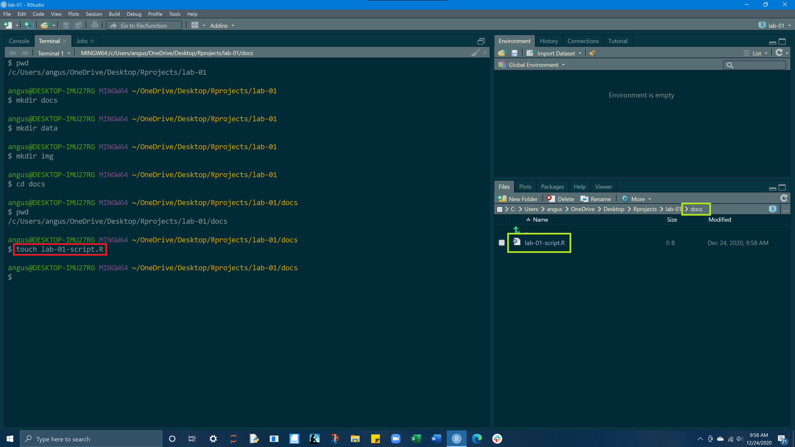

<br>

>Open your lab-01-script.R file and then in the bottom left hand quadrant where our terminal is, select `Console` from the tab row above.

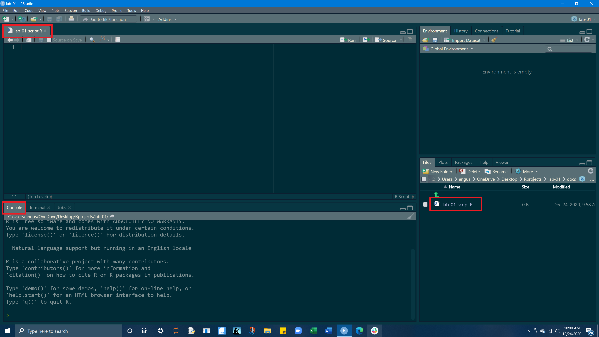


***

<br>
<br>

# **Load in your libraries**

>Now we will load a package into our workspace. We will do this by typing `library(tidyverse)` into our RScript and then pressing the `Run` button on the top right hand corner of your RScript. Code can also be run by the keyboard command `Cmd+Return` on Mac, and `Ctrl+Enter`	on Windows This is how you run lines of code from an RScript. Additionally if you highlight any portion of a code and run it, just the highlighted portion of code will be executed.<br>After you have loaded in the tidyverse package a bunch of seemingly random outputs should have appeared in your console. This is what you want and it is just details of the package being loaded.<br>When you run code, the output of that code will appear in the console, also any errors or warnings will display in the console.<br>

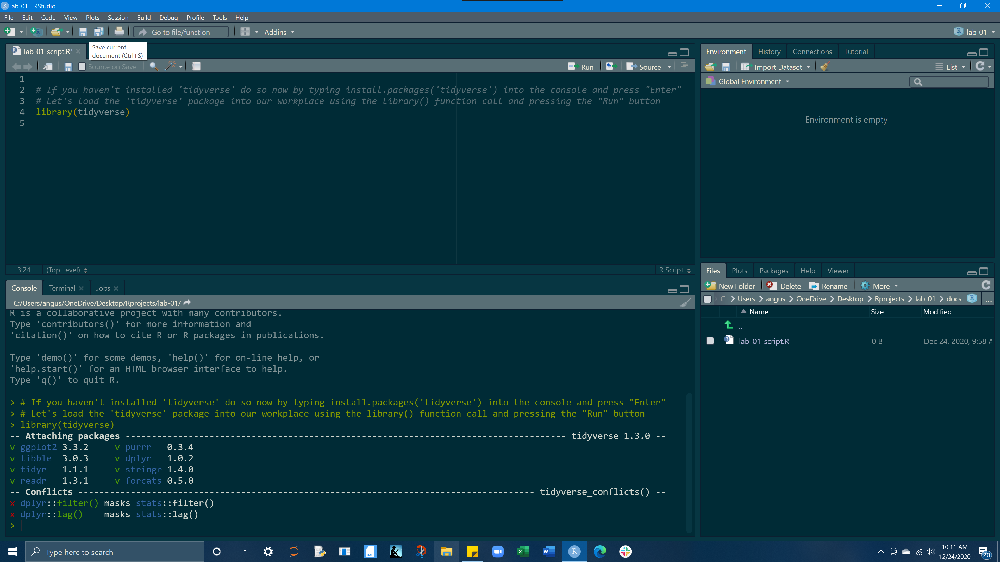
<br>

>Code can also be run from the console, but it does not allow you to go back and work on code, it will just take one line of code and return the output.

<br>
**Running code from an RScript vs. Console:**

- Enter `3 + 5` into your RScript and run it. What happened?
- Enter `x = 3 + 5` into your RScript and run it. A value for `x` should have been added to your environment pane (top right quadrent, select Environment tab if needed)
- What happens if you type `x` into your RScript and run it?
- Now see what happens when you type `x` into your console and press Enter


<br>

***

# **Variables**
Variable values are "bound" to a name using the = or <- assignment operators (they work identically, I prefer the "=")

```{r}
a = 3
a <- 3
```

<br>

***An objects will retain the value from the last line of code run***.<br>For example, we see that the object ***x*** is first assigned a value of 5 `(x = 5)`,<br>and then x is assigned a new value of 5 + 2 `(x = 5 + 2)`.<br>If x is called in the next line, we see the value of x is 7. 

```{r}
x = 5 
x = 5 +2
x
```

<br>

***But if we assign x to 5 after assigning x = 5 + 2, we see that x now equals 5***

```{r}
x = 5 
x = 5 +2
x = 5 
x
```

<br>

***Copy and paste the following code into your RScript, but before you run it all, take a guess at what you think what value `y` will have at the end. and `x`?***

```{r}
x = 5
y = 2
y = x
y
```

<br>

Lets say we stored information about UCSB in some objects:

```{r}
school = "UCSB"
lat = 34.4140
lng = -119.8489
```

<br>

If we wanted to we could add `lat` and `lng`

```{r}
lat +lng
```

<br>

But what if we try and add `lat` and `school`?

```{r, error = TRUE}
lat + school
```

This `non-numeric argument error` is saying that one of these objects is not a ***numeric value***, this leads into the idea that values have different classes/types

***

>***Don't worry if you feel overwhelmed its completely normal at this stage, there is a lot of information to take in. It will takes some time to feel comfortable with the Console/RScript/Environment interactions but before long, with practice, it will become intuitive!***

<br>

# **Data types**

Values in R can be one of 6 different types :

  1. **numeric** (e.g. 2, 2.15) - values w/ decimals<br>2. **integer** (e.g. 2L) - values w/o decimals (create w/ uppercase 'L')<br>3. **character** (e.g. "x", "Welcome!")<br>4. **logical** (e.g. TRUE, FALSE)<br>5. **raw** (e.g. holds bytes)<br>6. **complex** (e.g. 1+4i) - _we are going to ignore_

The `class()` function tells us what kind of object is it (high-level)<br>The `typeof()` function can tell us the object’s data type (low-level)
<br>
>***What's the difference between 3 (the number) and '3' (the character)?***

```{r,eval= TRUE}
class(3) # numeric
```
<br>

```{r,eval= TRUE}
class('3') # character
```
>When you surround a something in quotes (double or single), that element is coerced to the class of character, as shown above as the numeric 3 becomes a character once wrapped in quotes

<br>

## Numeric

>***Copy the following examples of different data types and use the `class()` function to examine the different data types***

```{r,eval= TRUE}
x = 3  
y = 3 * 400
z = 5 + 6
```

## Integer
```{r,eval= TRUE}
x = 2 # numeric
y = 2L # specifies as integer 
z = as.integer(c(4.1, 5.2, 6.3, 6.4)) # coerces values to integer type
```

## Character

You can use either Single quotes '' or double quotes "", R treats them identically

```{r,eval= TRUE}
x = "a"  
y = "bc"  
z = "I like turtles!!!"
```

<br>

## **Missing Values (NA)**
- Missing values still need a place holder
- Missing values are denoted with NA (short for not applicable).
- Missing values are 'infectious': most computations involving a missing value will return another missing value.

<br>

### **Useful NA function**

- `na.omit()` - removes all cases where an NA appears
- `is.na()` - indicates which elements are missing (NA), if element is NA it returns TRUE

<br>

```{r,eval= TRUE}
vec = c(5,6,7,8,NA)  
mean(vec) # the NA value in the vector results in a mean of NA
```
<br>
```{r}
mean(vec, na.rm = TRUE) # use na.rm = TRUE removes the NAs 
```

<br>

```{r}
x = c(NA, 50, NA, 9)
is.na(x) 
```

***

<br>
<br>


# **Data structures**


## **Vectors**

- Vectors can be created using the `c()` (combine) function
- The length can be checked with `length()`

***From the examples below, create your own vector made up of all character strings:<br>2. name of the state you were born in<br>1. name of your hometown***
  

```{r}
a = c(1,2,5.3,6,-2,4) # numeric vector
a
```
<br>
```{r}
b = c("one","two","three") # character vector
b
```
<br>
```{r}
c = c(TRUE,TRUE,TRUE,FALSE,TRUE,FALSE) #logical vector
c
```

<br>

```{r}
d = 1:10 # number sequence vector
d
```


<br>

### **Adding elements to a vector**

Here the character string "four" is added to the vector **b** from the above example
```{r}
b = c(b, 'four')
b
```

***Now try adding your favorite food (chr) to the vector you created vector***

<br>

### **Subsetting a vector**

Here are several different methods of subsetting a vector

```{r}
vector <- c(1, 2, 5.3 ,6 ,-2, 4) # numeric vector
vector[3] # subsets to only the 3rd element
```
<br>
```{r}
vector[-3] # removes 3rd element
```
<br>
```{r}
vector[1:3] # subsets elements 1 through 3
```
<br>

`setNames()` allows you to name each element in a vector
```{r}
vector = setNames(vector, c('A', 'B','C','D', 'E', 'F')) # names elements and reassigns named vector to original vector variable using =

vector[1:6] # display elements 1 through 6
```

***Using `setNames()`, give each element of your vector an appropriate name and then subset your vector to just your name and favorite food***

***

<br>
<br>

## **Lists**

An ordered collection of objects (components). A list allows you to gather a variety of (possibly unrelated) objects under one name. Extends vectors and allows elements to be any type

```{r}
list = list(
  1:5, 
  "water_level", 
  c(TRUE, FALSE, TRUE), 
  c(2.3, 5.9)
)
typeof(list)
```

<br>

### **Subsetting a list**
The content of elements of a list can be retrieved by using double square brackets.

<br>

```{r}
class(list)
```
<br>
```{r}
list[[1]]
```
<br>
```{r}
list[[1]][1]
```
<br>
```{r}
list[[2]]
```
<br>
```{r}
list[[3]][2]
```

***

<br>
<br>

## **Dataframes**

- a named list of vectors.

- data.frames are one of the biggest and most important ideas in R, and one of the things that make R different from other programming languages

- Unlike a regular list, in a `data.frame`, the length of each vector must be the same.

- typically dataframes are read into R via `read_csv`, `read_table`, or `read_xls`, depending on the file type 

- dataframes can also be built using the `data.frame()`function

<br>

> ***Below is an example of a dataframe with 3 columns, `num`, `color`, and `boolean`<br> The rows of the dataframe contain the values from the vectors***

```{r}

num = c(1,2,3,4)
color =  c("red", "white",  
           "green", NA)  
boolean = c(TRUE,TRUE,  
             TRUE,FALSE) 
df = data.frame(num, color, boolean)

df
```


<br>

### **Structure of a dataframe**
The data frame is 4 objects (rows) by 3 variables (columns)<br>Notice the `num`, `chr`, `logi` classisifcation of the 3 different columns

```{r}
str(df) 
```

<br>

### **Subsetting a dataframe**

```{r}
df[1,2]  # row 1, column 2
```
<br>
```{r}
df[2,]  # row 2, all columns
```
<br>
```{r}
df$color[1] #  row 1 in column color
```
<br>
```{r}
df$num[2] # row 2 in column num
```
<br>
```{r}
df[1:2] # columns 1 through 2 of dataframe
```

<br>

### **Create a dataframe by hand**

```{r}
df2 = data.frame(id = letters[1:8], x = 1:8, y = 9:16)
df2
```


### **Useful dataframe function**

- `head()` - shows first 6 rows
- `tail()` - shows last 6 rows
- `dim()` - returns the dimensions of data frame (i.e. number of rows and number of columns)
- `nrow()` - number of rows
- `ncol()` - number of columns
- `str()` - structure of data frame - name, type and preview of data in each column
- `names()` or `colnames()` - both show the names attribute for a data frame
- `sapply(dataframe, class)` - shows the class of each column in the data frame

>`head()`

```{r}
head(df2)
```

<br>

>`tail()`

```{r}
tail(df2)
```

<br>

>`nrow()`

```{r}
nrow(df2)
```

### **Preloaded R Datasets**

R comes with several preloaded data sets<br>running `data()` in an RScript will return all of the avaliable toy datasets

>mtcars<br>
For example, mtcars is a list of Motor trend cars containing each cars attributes in the columns. It is commonly used as an example dataframe

```{r}
m =mtcars
class(m)
```

<br>
**Dimensions & structure of mtcars**
```{r}
# Dimensions & structure of mtcars
dim(mtcars)  
str(mtcars)  
```

<br>
**Subsetting mtcars**
```{r}
mtcars[1:5,] # rows 1-5, all columns
```
<br>
```{r}
mtcars[1, 1:6] # row 1, columns 1-6
```
<br>
```{r}
mtcars[1:4,1:4] # rows 1 -4, cols 1-4
```

***

# **Assignment**


## **1. Create vectors containing information about 8 family/friends/pets in your life**
**Vectors ** `name`, `age`, `species`, `relation` (relative to you), `hair_color`, `eye_color`, and `retired`

- **name:** character
- **age:** numeric
- **species:** character
- **relation:** character
- **hair_color:** character
- **eye_color:** character
- **retired:** logical (TRUE or FALSE)

<br>
<br>

## **2. Make a dataframe using these 8 vectors as your column headers**
  - **hint:** `df = data.frame(col = )`
<br>
<br>

## **3. Explore the structure of your dataframe and its appearance in the environment pane**
  -  **Navigate to your environment (Upper right hand pane), locate your dataframe, and double click to open it in a new pane**
  - `str(df)` - structure of your dataframe 
  - `dim(df)` - dimensions of your dataframe
  - `class(df)` - class of the dataframe
  - `class(df$column)` - class of a column in the dataframe

<br>
<br>

## **4. Subset your dataframe using 3 different methods shown in this lab**
  - Subset yourself and one other person and assign the output to a new dataframe variable
  - Remove just yourself and assign this to a new dataframe
  - Lastly, create a new dataframe variable that contains only names, hair color, eye color, and species and assign this to a new variable.

  - `df$column` 
  - `df[row, column]`
  - `df[col1:col2]`

  - ***Once completed, you should have 4 dataframes in your environment (the original and 3 subsetted dataframes)***

<br>

---

# **END**

<br>
<br>


