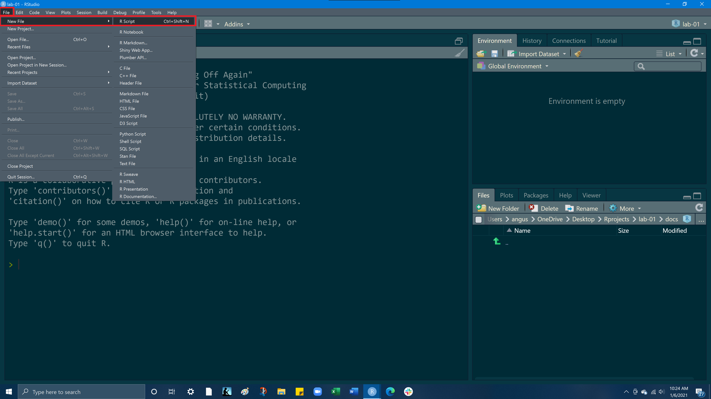

<style type="text/css">
span.code {
      background:rgba(240,128,128, 0.2);
      border-radius: 5px 5px 5px 5px;
      padding-left:5px;
      padding-top:2px;
      padding-right:5px;
      padding-bottom:2px;
      color:red;
     } 
</style>
***

# **Goals**

- Make a folder for this class that will be the home for all your projects
- Learn how to make a new project in RStudio and build a reproducible & organized file structure within a project
- Install packages and load them into your environment
- Explore the basics of RStudio
- Understand the different data types & data structures in R
- Get comfortable working with the different data types & data structures

***

# **Create a folder for this class**

### **MacOS <i class="fa fa-apple" aria-hidden="true"></i>**

First, we will create a new folder on our desktop that we'll use to organize our RStudio projects for this class. 
Navigate to your desktop, and right click and click `New folder`. A new folder should appear on your desktop, to rename the folder, double click on the folder's name and give it the name `Rprojects`


<br> 
<br> 

### **Windows <i class="fa fa-windows" aria-hidden="true"></i>**

On windows, do the same thing but when you right click on the desktop hover over `New` and the click `Folder` 


<br>
<br>

**Next open RStudio, if you do not see RStudio on your desktop you can open it by searching RStudio**

**On a Mac**, in the the top right hand corner of your screen select the magnifiying glass icon and enter RStudio

**On windows**, in the bottom left hand corner of your screen enter RStudio into the search box with the magnifying glass

# **Create a new project in RStudio**

**Open RStudio and click on `File` in the top left hand corner of the page, and then select `New Project`**


<br>
<br>

**Select `New Directory`**


<br>

**Select `New Project`**


<br>

For `directory name` enter **Lab-01**<br>Under `create project as subdirectory of` select browse and find and select the ***Rprojects*** folder you created on your desktop<br>Check the `Open in new session` box in the bottom left hand corner<br><br>After entering the above information, select `Create Project`,<br>***RStudio will automatically open the new project,  you can also access your `lab-01.Rproj` from your Rprojects folder on your desktop.***


***


# **Build a project file structure**


Now we are going to create a simple file structure to help keep our project organized. We will populate our project with `docs`, `data`, and `img` folders


<br>

## <span class = "code">New Folders</span> - docs & data

We will now creates a new folder (directory) inside our current working directory<br>**In the bottom right hand pane, within the Files tab, click Click <span class = "code">New Folder</span>, name your new folder, `docs`.** This will create a new folder (directory) within your current working directory.<br> **In the bottom right hand pane, select File from the top row of tabs, you should now see your docs, data, and img folders**


Go ahead and do this again to make a `data` folder in your project.
These folders will hold all the components of your project.<br>The `docs` folder is for your Rscript (.R) and Rmarkdown (.Rmd) files and the `data` folder will house your .CSV, .xls, .txt files. 


<br>

**Make a new folder `docs`**


<br>

**Check that the docs folder was created and take note of where this folder is**<br>Your docs folder is now in your lab-01 project, within your Rprojects directory, which is on your desktop


<br>

**Go ahead and do this again to make a `data` folder in your project.**


These folders will hold all the components of your project. The `docs` folder is for your Rscript (.R) and Rmarkdown (.Rmd) files and the `data` folder will house your .CSV, .xls, .txt files. **

<br>

## <span class= "code" >Open a RScript</span> 
**In the top left corner, click `File`, hover over `New file` and then click <span class= "code" >RScript</span>**




**A new pane should open up, this is your <span class= "code" >RScript</span> file.** Notice that an RScript files end with `.R`. 

<br>

Your Rscript is currently **"Untitled,"** so lets now click the save button at the top of the pane and give it a name and a location to be saved to.

<br>


**Name the file `lab-01-script` and then navigate to your Rprojects folder on the desktop, and into your `lab-01` project, and finally into your docs folder, and then press save.** 


<br>

Now in the bottom right hand pane, under the `file` tab, open your `docs` folder and check to see if your `lab-01-rscript.R`saved.


We now have created a file structure and an RScript file in RStudio. This is a cookie-cutter file structure that should work for most projects you will ever do in RStudio. Having files organized in the same manner from one project to the next will make your life much easier and more efficient going forward!

<br>
Before we moving forward to the next section, make sure that in the bottom left hand quadrant where the terminal, select the `Console` from the tab row above.


<br>
<br>

***


<br>

# **Load in your libraries**

Now we will load a package into our workspace. We will do this by typing `library(tidyverse)` into our RScript and then pressing the `Run` button on the top right hand corner of your RScript. Code can also be run by the keyboard command `Cmd+Return` on Mac, and `Ctrl+Enter`	on Windows This is how you run lines of code from an RScript. Additionally if you highlight any portion of a code and run it, just the highlighted portion of code will be executed.<br>After you have loaded in the tidyverse package a bunch of seemingly random outputs should have appeared in your console. This is what you want and it is just details of the package being loaded.<br>When you run code, the output of that code will appear in the console, also any errors or warnings will display in the console.<br>


<br>
<br>

**Lastly, we will install the `here` package,** we will learn more about this package in during Lab 2.  

<br>

Type `install.packages('here')` into your console and press enter. A  bunch of text should appear in your console, don't worry, this is what we want. This means the package is downloading and being "unpacked." 

```{r, eval=FALSE}
install.packages('here')
```
**Save your file project before closing your RStudio sessions, we will pick up from here in Lab 2**

---

# **END**

<br>
<br>


